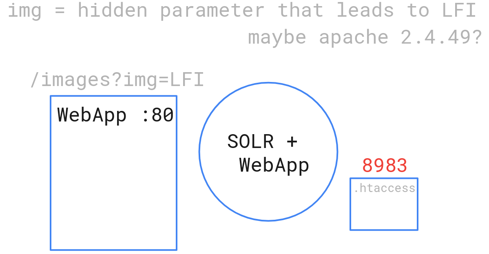

# log4j-box


to build use the following command

```bash
docker build -t log4j_box .
```

to run the container use

```bash
docker run -d -p 8983:8983 log4j_box
```

the container should now be available on port 8983 on your host
